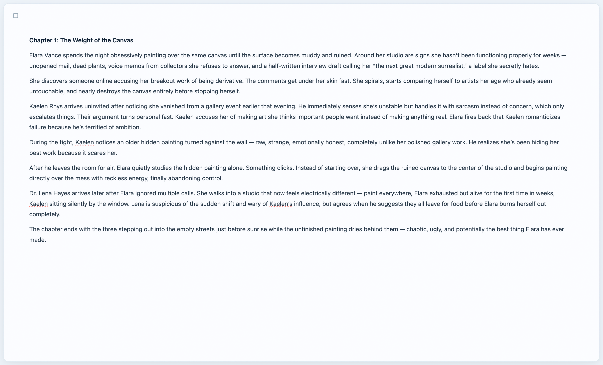
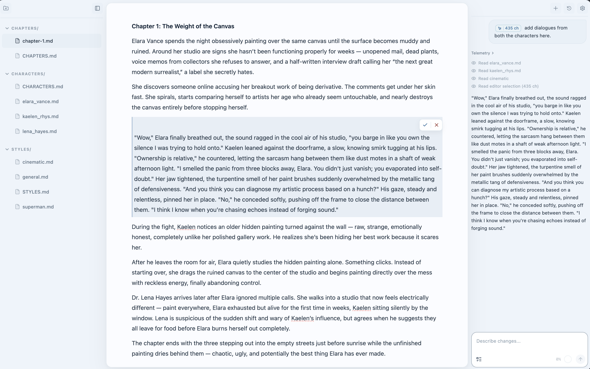
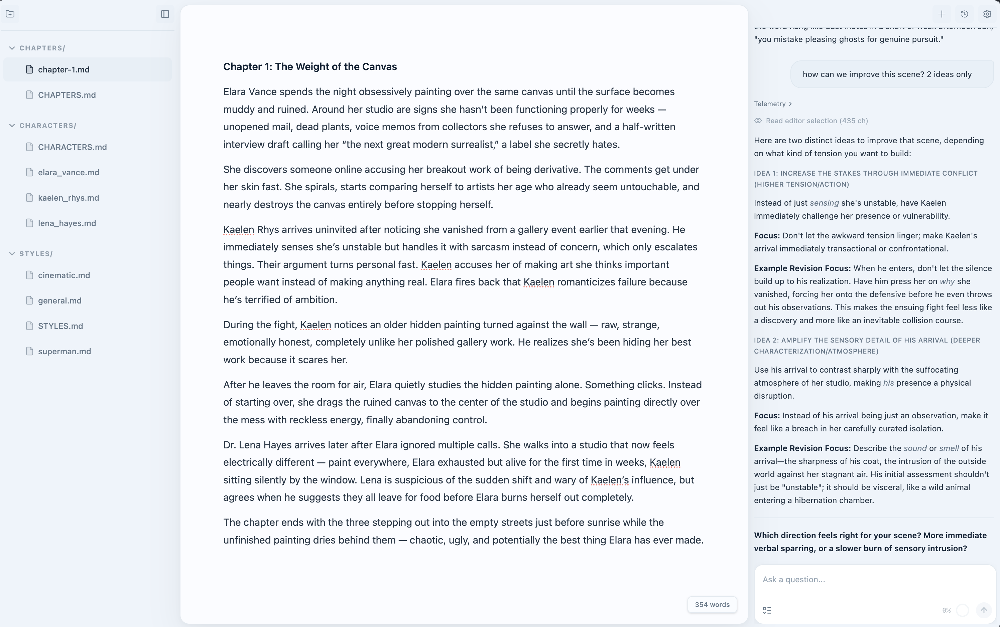

<picture>
  <source media="(prefers-color-scheme: dark)" srcset="assets/gh-cover-white.png">
  <source media="(prefers-color-scheme: light)" srcset="assets/gh-cover.png">
  
</picture>

---

Margin is an open-source, local-first AI writing studio for Markdown users.

Think of it as SillyTavern for story writing: a customizable environment where writers can collaborate with context-aware AI agents, swap models, manage prompts, and build their own creative workflows—all while keeping their work on their own machine.

Instead of treating AI as a chat window, Margin integrates it directly into the writing process. Draft scenes, brainstorm plots, maintain world lore, rewrite passages, and iterate on ideas inside a distraction-free editor designed for long-form writing.

## Why margin?

* **Markdown-Native Writing Environment** — A distraction-free editor designed for long-form writing projects and documentation.
* **Runs Locally** — Your manuscripts, notes, and context stay on your machine. No required cloud services or telemetry.
* **Optimized for Local Models** — Works well with lightweight language models and supports Ollama, LM Studio, and OpenAI-compatible providers.
* **Automatic Context Management** — Organize characters, lore, outlines, and style guides into folders. Margin automatically includes the relevant context for each task.
* **Customizable AI Workflows** — Configure prompts, agents, and writing pipelines to match your process instead of adapting to rigid presets.
* **Interactive Diff Review** — Review AI-generated edits with clear inline diffs before accepting or rejecting changes.

---

## Screenshots

  <table>
    <tr>
      <td></td>
      <td></td>
    </tr>
    <tr>
      <td></td>
      <td></td>
    </tr>
  </table>

## Getting Started

See the [Getting Started guide](docs/getting-started.md) for setup instructions, prerequisites, and configuration.

## Docs

- [AI Assist](docs/ai-assist.md) — Edit and Chat modes, context window, reasoning
- [Writing Guide](docs/writing-guide.md) — Dual-agent system, manifests, character profiles, workspace demo.
- [Configuration](docs/configuration/general.md) — Workspace, appearance, editor, endpoints, context settings

## Contributing

We welcome contributions of all kinds. See [CONTRIBUTING.md](CONTRIBUTING.md) to get started. Please read our [Code of Conduct](.github/CODE_OF_CONDUCT.md).

## License

This project is licensed under the **GNU Affero General Public License v3.0** — see [LICENSE](LICENSE) for details.

Commercial licenses are available for proprietary use. [Contact us](https://github.com/prxshetty/margin) for details.
